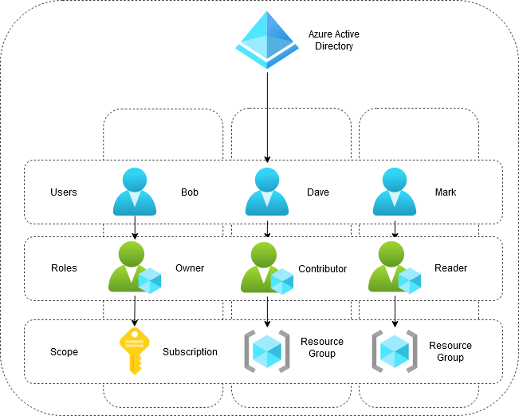
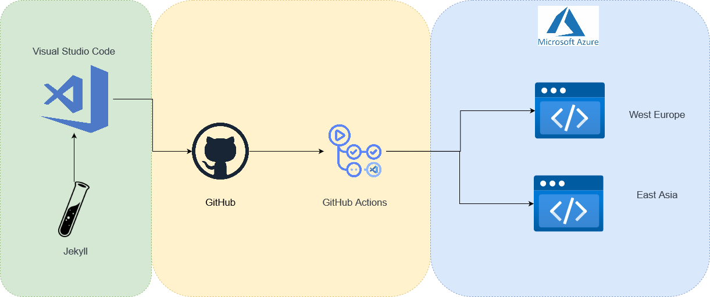
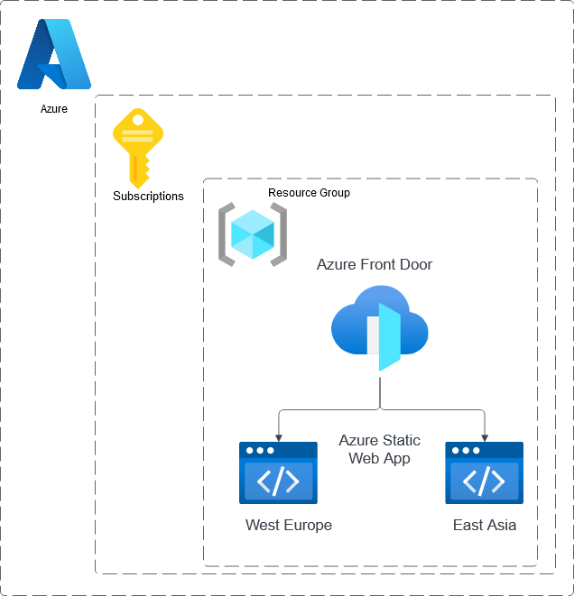
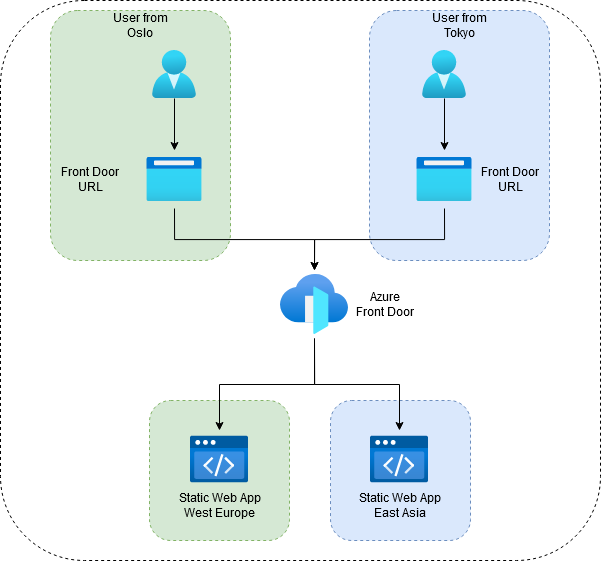

# Case 2 Pineapple Pizza Static Web App

## Users

For this solution there are created three users; Bob, Dave and Mark.

* Bob has requirements to manage billing for the Pineapple Pizza Website and is the owner of Pineapple Pizza.
  Therefore he is given the ***Owner*** role for the Azure Subscription. Owner role gives permissions to manage all resources and delegate access to other users. He will also be able to see the billing for this subscription.

* Dave has requiements for access to the resources on Azure for the Pineapple Pizza Website, but not overall permissions to the subscription. Based on the principle of least privelege Bob is therefore given the ***Contributor*** role to the resource group.

* Mark requires only read-only permission to the Pineapple Pizza resources. And are therefore given the ***Reader*** role for the resource group. This role gives him read permissions only to the resources within the resource group where the Pineapple Pizza Website are placed.

### User roles diagram

## Static Web App With Jekyll

The Static Web App for Pineapple Pizza are deployed using a static site generator called _Jekyll_.
This generator makes it possible to deploy the new changes to the static web app automatically as the new code are pushed. In this case changes to the code are pushed to _GitHub_, and the changes are automatically built and deployed using _GitHub Actions_.

1. **Download**
   
   First Jekyll and prerequisites has to be installed locally using Windows Subsystem for Linux. 
   
   This was done following the tutorial from Jekyll: [Jekyll on Ubuntu | Jekyll • Simple, blog-aware, static sites](https://jekyllrb.com/docs/installation/ubuntu/) 

2. **Create App**
   
   The Jekyll app was created locally.

3. **Push to GitHub**
   
   The repository for the application was then pushed to a GitHub repository.

4. **Create Static Web App in Azure Portal** 
   
   The Static Web App was set up in the Azure Portal and the application repository from GitHub was used.
   
   * First a resource group named for the static web app was created.
   
   * The hosting plan for the web app was sett to Free.
   
   * Source for the deployment was set to GitHub and credentials are provided.
   
   * When the Static Web App is created in the Azure Portal, the repository with the application code are deployed using GitHub Actions.

5. **Changes with GitHub Actions**
   
   GitHub Actions is used for this deployment. Changes to the code are pushed to GitHub and deployed through GitHub Actions.

6. **Azure Front Door**
   
   For Loadbalancing Azure Front Door is provisioned. This Load Balancing service meets the requirements for geo-redundant access. Since the application are to be accessable from London, Oslo, Singapore and Tokyo geo-rendunance is a requirement.

7. **Azure Monitor Alerts**
   
   The Azure service, *Monitor* provides the possibility to set up Alerts to help detect issues and adress these before this becomes a problem for customers and end users. Notifications can be configured to notify when an issue is detected. 
   
   Metrics are used as the source in the Azure Monitor data platform. The alert rule monitors the telemetry data, captures signals and checks to see if these sinals meet the critaria of conditions. If these conditions are met, the alert is triggered and the associated action group triggers the notification. 
   
   The rule requirement is that an email to the owner of Pineapple Pizza, Bob are to be sent if over 100 requests are sent to the Front Door solution.

8. **ARM-templates** 
   
   Azure Resource Manager Templates are downloaded from the Azure Portal. This makes is possible to deploy the application and related services by other developers in case of need. 

### Workflow Diagram

* Jekyll is used for generating the static site.

* Visual Studio Code is the IDE used for witing application code.

* The code is then pushed to GitHub.

* Each time new code is pushed, GitHub Actions CI/CD pipeline runs, and if the run is successful the new changes will be deployed to the static web apps in Azure.

## Azure Infrastructure Diagram

Within the subscription the resource group for the static web apps are created. Within this resource group the two Static Web Apps and the Azure Front Door loadbalancer are placed.

## Front Door Routing of user request

Azure Front Door is a Content Delivery Network that provides users global access to the web content. When a user from Oslo request the web app using the URL for the Front Door Service he will be sent to the Static Web App hosted in West Europe. The request is forwarded based on latency, and therefore forwarded to the lowest latency origin Static Web App. The requests are therefore sent to the nearest set of origin based on Network latency.

## Alert Diagram

An Alert created in Azure Monitor based on the Metrics for Azure Front Door will trigger an Alert Rule if the conditions are met. Here the conditions are that the Alert Rule is triggered if there are over 100 requests to the Azure Front Door. The Alert Rule is set to notify the Action Group with the user Bob on email of this event.

